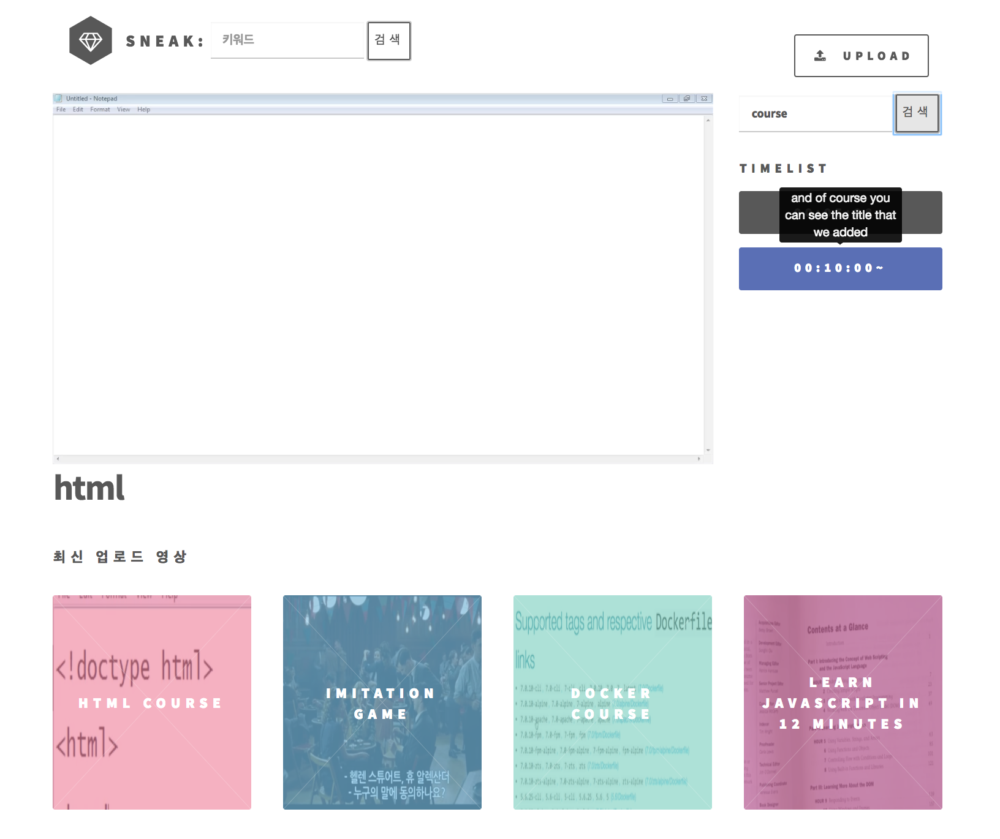

# Vsearch
-------------
## 1. 목차
```
.Vsearch
├── 1.목차
├── 2.개요
├── 3.사용법
|   ├── 3.1.환경 세팅
|   └── 3.2.실행 방법
├── 4.실행 사진
|   ├── 4.1.메인 화면
|   └── 4.2.검색 화면
└── ...
```


## 2. 개요
 - 동영상에서 발생하는 음성을 인식하고, 사용자가 찾고자하는 keyword를 검색하는 웹애플리케이션입니다. keyword를 검색하면 해당 keyword가 발생하는 지점들의 시간 리스트가 나오고, 클릭 시 그 시간부터 재생하게 됩니다. 


## 3. 사용법
### 3.1. 환경 세팅
- OS : Ubuntu 16.04 LTS
- DB : GCP Datastore(Nosql)
- Storage : GCP Storage
- Language : Golang 1.10, Python 3.6, Java 1.8, JavaScript ES5
- Opensource / Program : Sox, FFmpeg, ElasticSearch, Kibana

### 3.2. 실행 방법
```
# git clone https://github.com/JinHyukParkk/Vsearch
# make
```


## 4. 실행 사진
### 4.1. 메인 화면
 
 -------------

### 4.2. 검색 화면
 

